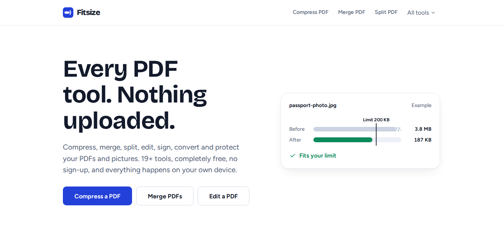
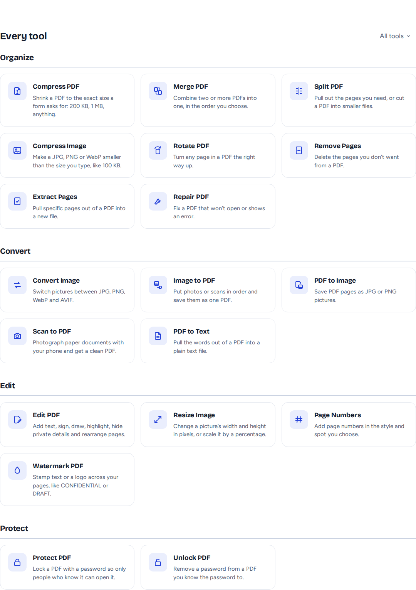
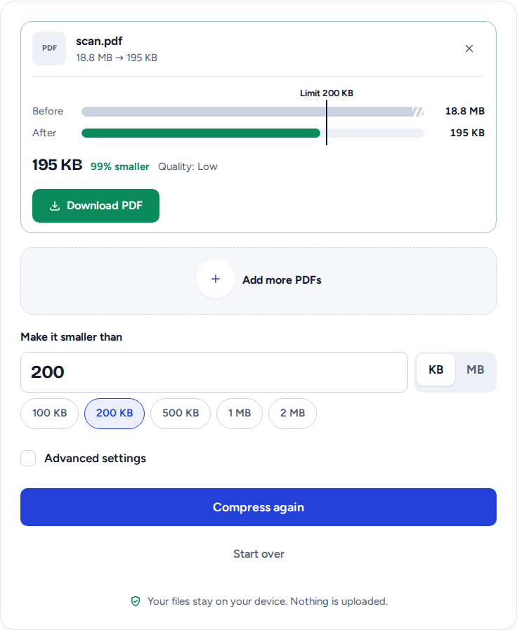
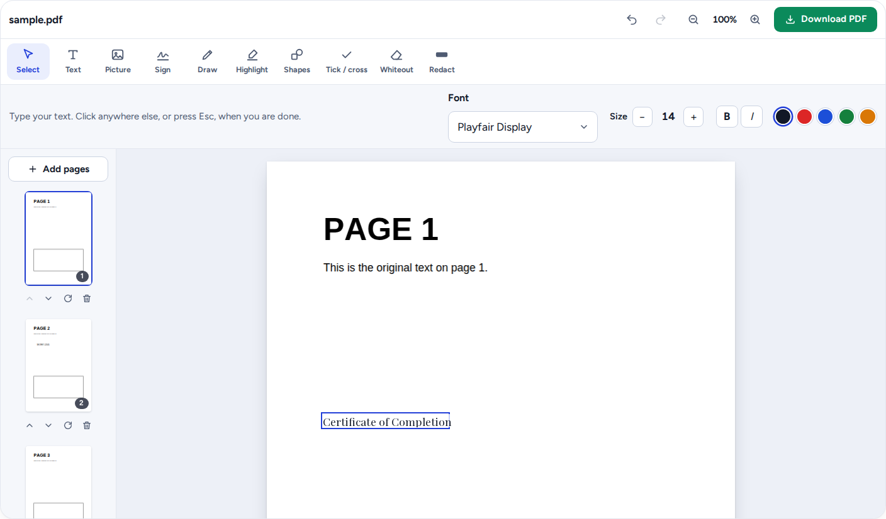

<div align="center">


# Fitsize

### Every PDF tool. Nothing uploaded.

Compress, merge, split, edit, sign, convert and protect PDFs and pictures — entirely in your
browser. No server ever sees your files, because there is no server.

[**Live demo →**](https://fitsize.pages.dev) &nbsp;•&nbsp;
[Report a bug](https://github.com/Anismansuri03/fitsize/issues/new?template=bug_report.yml) &nbsp;•&nbsp;
[Request a tool](https://github.com/Anismansuri03/fitsize/issues/new?template=feature_request.yml)

[](https://github.com/Anismansuri03/fitsize/actions/workflows/ci.yml)
[](LICENSE)
[](CONTRIBUTING.md)




</div>

## Why this exists

iLovePDF, Smallpdf, Sejda, and the rest all do the same thing: your file leaves your device,
touches a server somewhere, and comes back. That's the whole business model — free tiers rate-limit
you into paying, because every conversion costs them real server time.

Fitsize doesn't have that problem, because it doesn't have a server. PDF compression, editing, and
every conversion run as WebAssembly, in your browser tab, on your own device. There's no upload to
wait on, no daily limit to hit, no account, and nothing to leak in a breach — because your file was
never anywhere but your computer.

| | Fitsize | iLovePDF | Smallpdf | Sejda |
|---|:---:|:---:|:---:|:---:|
| Your file ever leaves your device | **Never** | Yes | Yes | Yes |
| Daily/hourly task limit | **None** | Throttled | 2/day | 3/hour |
| Account required | **No** | For full access | Yes | For full access |
| Ads on the free tier | **None** | Yes | No | No |
| True redaction (not just a black box) | **Yes** | No | Pro only | Yes |
| Price | **Free, forever** | Freemium | Freemium | Freemium |

*(Competitor details as of the tools' public pricing/feature pages — worth double-checking, since
they change theirs and I can't change this table for them.)*

## What it does



**Organize** — Compress PDF *(to an exact size you type, not just "smaller")*, Merge, Split,
Rotate, Remove Pages, Extract Pages, Repair a damaged PDF, Compress Image

**Edit** — a full PDF editor (text in any language, signatures, pictures, drawing, highlighting,
shapes, whiteout, real redaction, page management, undo/redo), Page Numbers, Watermark, Resize Image

**Convert** — Image ⇄ PDF, Scan to PDF *(phone camera, auto-cleans the photo like a real scanner)*,
PDF to Text, JPG/PNG/WebP/AVIF conversion

**Protect** — Password protect (real AES-256), Unlock

Two things every tool promises and actually keeps:

- **"Under 200 KB" means under 200 KB.** Compress PDF and Compress Image binary-search quality and
  size until the result is strictly under your target — never over — and say so plainly if your
  target genuinely can't be reached, instead of quietly handing back something bigger.

  

- **The PDF editor embeds real fonts**, including Google Fonts (Inter, Roboto, Poppins, Playfair
  Display, Merriweather, Caveat), subsetted into the saved file — so text you add stays real,
  selectable, searchable text, not a picture of text pretending to be a PDF.

  

## Try it

```bash
git clone https://github.com/Anismansuri03/fitsize.git
cd fitsize
npm install
npm run dev
```

Open http://localhost:4321. That's it — no API keys, no `.env` file, no backend to stand up.

## How it works

| Job | Engine |
| --- | --- |
| PDF compression, repair | [Ghostscript](https://www.ghostscript.com/) compiled to WebAssembly, run in a Web Worker |
| Merge, split, rotate, page numbers, lock/unlock a PDF | [qpdf](https://qpdf.sourceforge.io/) compiled to WebAssembly, run in a Web Worker. Edits the PDF's structure directly, so pages are never redrawn or degraded |
| Picture codecs | Squoosh's WebAssembly codecs via jSquash: MozJPEG, oxipng, libwebp, libavif, Lanczos resize |
| PDF ⇄ pictures, and the editor's redaction fallback | [pdf.js](https://mozilla.github.io/pdf.js/) (legacy build, for older browsers too) |
| Building PDFs, fonts, ZIPs | [pdf-lib](https://pdf-lib.js.org/) (+ fontkit for Google Font embedding), [fflate](https://github.com/101arch/fflate) |
| Site | [Astro](https://astro.build/) (static) + React islands only where a page needs interactivity |

The "guaranteed under this size" search is two small, dependency-free, unit-tested files:
[`src/lib/fit/fitToSize.ts`](src/lib/fit/fitToSize.ts) (pictures) and
[`src/lib/fit/fitPdf.ts`](src/lib/fit/fitPdf.ts) (PDFs) — a good place to start reading the codebase.

The PDF editor's geometry (why marks land in the right place even on a rotated page) lives in
[`src/lib/editor/placement.ts`](src/lib/editor/placement.ts), also unit-tested. See
[`CONTRIBUTING.md`](CONTRIBUTING.md) for a fuller map of the codebase.

## What it won't do (on purpose)

- **Rewrite existing text in a PDF, in place** — no tool that runs purely in a browser can do this
  reliably, and I'd rather say so than fake it. The editor covers the old text (Whiteout) and lets
  you type new text on top, which is how Sejda and most others handle this too.
- **PDF ⇄ Word/Excel/PowerPoint, or HTML → PDF** — doing these well needs real office software
  (LibreOffice) running server-side. Faking it in the browser produces broken layouts, and shipping
  that just to check a box isn't worth it.

## Deploy your own, free, on Cloudflare Pages

No command line needed:

1. Fork this repo.
2. In the Cloudflare dashboard: **Workers & Pages → Create → Pages → Connect to Git**, and pick your fork.
3. Cloudflare's **Astro** preset fills in the build settings (`npm run build`, output `dist`). Leave them.
4. Add an environment variable **`SITE_URL`** set to your `*.pages.dev` address (shown after the first
   deploy) so canonical links and the sitemap are correct, then redeploy once.
5. Under **Settings → Builds & deployments**, set **Trailing slash** to **Add trailing slash**.

Every push redeploys automatically. The whole build is ~36 MB across ~350 files — comfortably inside
Cloudflare Pages' free-plan limits (20,000 files, 25 MiB per file). See
[`docs/DEPLOY.md`](docs/DEPLOY.md) for a Cloudflare Workers/CLI alternative and troubleshooting.

## Contributing

Bug reports, new tools, and translations are all welcome — see
[`CONTRIBUTING.md`](CONTRIBUTING.md) for the local setup, the one non-negotiable rule (nothing gets
uploaded, ever), and where things live in the codebase. Every PR runs type-checking, the unit test
suite, and a production build automatically via GitHub Actions.

## Licence

Fitsize is free software under the **GNU AGPL v3** (see [`LICENSE`](LICENSE)) — a copyleft licence
required because Ghostscript, one of the engines this project depends on, is itself AGPL. In
practice: if you run a modified version of Fitsize as a public web service, you must offer your
users that version's source code. Using it, forking it, and self-hosting it as-is are all completely
free with no strings beyond that.

Picture tools use the [Squoosh](https://github.com/GoogleChromeLabs/squoosh) codecs
(MozJPEG, libwebp, libavif, oxipng).
